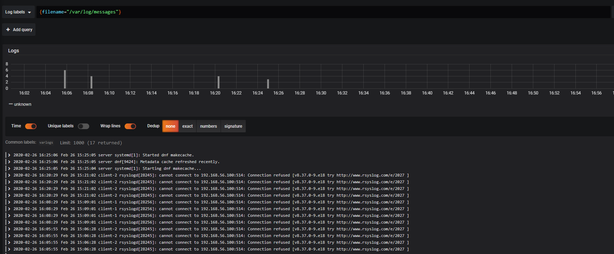

# Projet Infra UF B2

## Speech

Ceci est notre projet d'infrastructure et système d'information de 2ème année à Ynov Informatique, où nous avons choisi d'avoir les thèmes principaux suivant:

    - Sauvegarde/Centralisation (Tri) des logs
    - Monitoring
    - Wiki
    - Docker & vagrant

Cette infra sera sous un kernel Linux (client et serveur sous CentOS 8).

Les fichiers utilisés lors de la mise en place du projet se trouvent dans le dossier [compose](./compose)

Dans le dossier [files](./files) vous trouverez nos premier pas dans le monde de vagrant / docker (pas très beau à voir), le fichier [Vagrantfile.orig](./Vagrantfile.orig) est lui aussi l'un de nos prémisse concernant les vagrantfile (toujours aussi moche)

Nom | reseau | ip
--- | --- | ---
Serveur | 192.168.56.0 | 192.168.56.100
Client-1 | 192.168.56.0 | 192.168.56.111
Client-2 | 192.168.56.0 | 192.168.56.112

## I - Installation

Veuillez vous référer au fichier suivant: [Install.md](./Doc/Install.md)

## II - Grafana

Vous pourrez retrouvez tout nos services sous grafana.
Lors de votre première arrivée sur grafana à cette adresse `http://192.168.56.100:3000/login` vous devrez vous log.

---

Suite à quoi vous aurez juste besoin de skip l'étape d'après

---

Lorsque vous êtes connecté vous devrez joindre la base de donnée prometheus avec grafana

---

Vous devrez le remplir de cette manière

---

Par la suite nous allons ajouter une configuration pour loki

---

Il sera rempli de cette manière

---

Revenez sur le menu principale et cliquez sur `Home` -> `Import dashboard`

---

Demandez le package `7107` et cliquez sur `Load`

---

Ajoutez la bdd prometheus que nous avons créée tout à l'heure et cliquez sur `import`

Bravo vous avez un dashboard avec toutes les infos sur vos clients !

---

Finissons par les logs de nos clients.
Cliquez sur la boussole qui vous donnera la catégorie `Explore`

---

Cliquez sur le `{job="default/prometheus"}`

--- 

Selectionnez les messages

---

Voilà, vous avez les logs de vos clients

### I - Sauvegarde/Centralisation (Tri) des logs

Les logs sont centralisés sur le server et accessible via le grafana du serveur à l'adresse suivante : http://192.168.56.100:3000

Pour afficher les logs, sur Grafana, aller dans Explore (la petite boussole), cliquer sur Log Labels, sélectionner File name et prenez /var/log/messages

### II - Monitoring/Alerting 

Concernant le monitoring et l'alerting, nous avons mis en place netdata sur nos clients et une centralisation des netdata sur le server visible grâce à grafana (en docker) accessible par interface web à l'adresse suivante: http://192.168.56.100:3000 lorsque le serveur est up.

Vous devrez aller à cettre adresse IP: http://192.168.56.100:3000

## III - Wiki

Pour la documentation interne, nous avons un wikijs (en docker) accessible sur le serveur à l'adresse : http://192.168.56.100:8080
)
